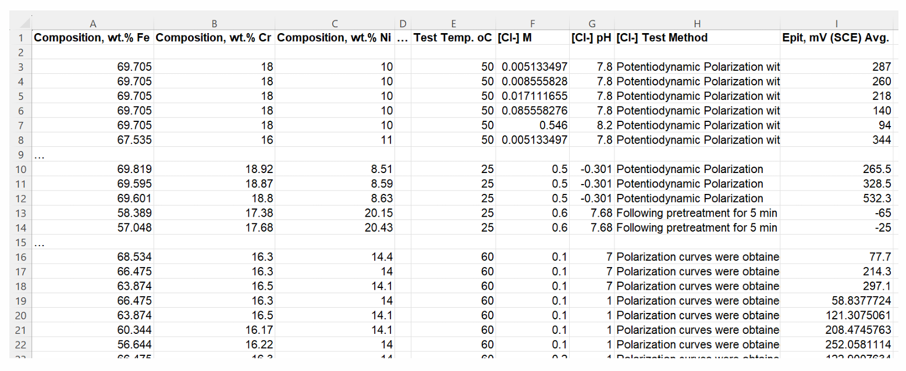
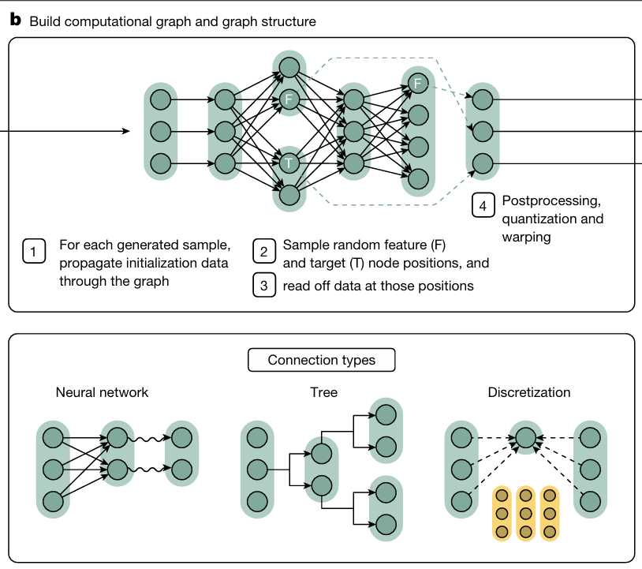
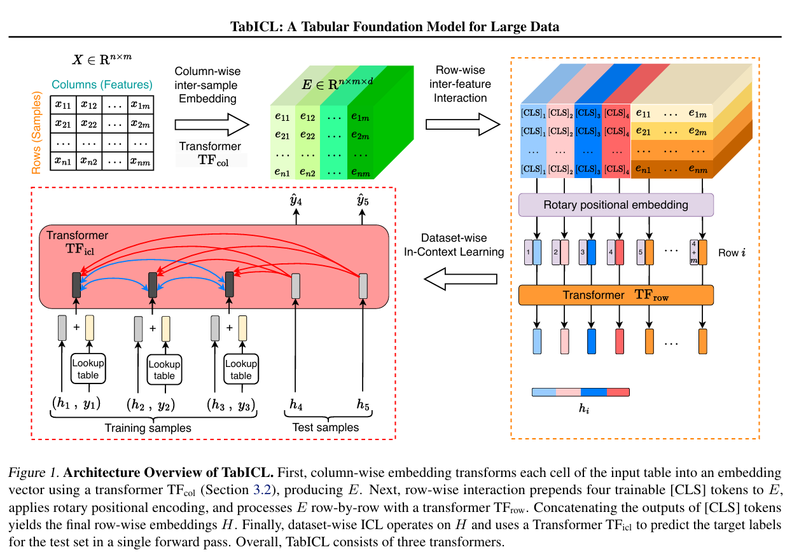

# How a normal machine-learning model predicts EPIT

## Conventional machine learning

- A conventional model is trained directly on the available corrosion dataset.
- It repeatedly compares predictions with measured EPIT values and adjusts its parameters.
- The result is one model fitted specifically to this dataset.
- A different target or dataset normally requires new training.
- With limited and heterogeneous corrosion data, a flexible model can overfit dataset-specific patterns.

---

# A model pretrained to learn from tables

## Tabular in-context foundation models

- TabICL is pretrained before seeing the real EPIT task.
- Pretraining uses many automatically generated synthetic tables.
- Every table contains example rows and rows whose targets must be predicted.
- During EPIT evaluation, measured training rows are supplied as context.
- The pretrained parameters remain fixed.

**The model still needs labeled EPIT examples.** It uses them as context during prediction rather than to retrain its parameters.

---

# The corrosion task

- **Source:** Nyby et al., *Scientific Data* (2021); an open-access Figshare dataset compiled from 85 literature sources.
- The pitting-potential section contains **810** measurements across Fe-, Al-, Ni–Cr–Mo, high-entropy and other alloys; **760** have a usable numeric average EPIT.
- **21 input features:**
  - 17 alloy-composition columns;
  - temperature, chloride concentration, and pH;
  - test method.
- Higher EPIT generally indicates stronger resistance to pit initiation under comparable conditions.
- EPIT depends jointly on alloy chemistry, environment, and experimental procedure.
- The dataset combines measurements from different test protocols.

---

---

<!-- _class: compact -->

# Performance: conventional ML vs. in-context models

- CatBoost is trained on each corrosion training split, whereas TabICL uses the same labeled rows as context without updating its pretrained parameters.
- Using the same five data splits and evaluation metrics, pretrained TabICL V2 provides the strongest overall performance.

| Model | Spearman | MAE (mV) | RMSE (mV) | $R^2$ |
|---|---:|---:|---:|---:|
| CatBoost | 0.8300 | 144.7 | 216.6 | 0.7395 |
| Generic retrained TabICL | 0.8372 | 151.4 | 212.7 | 0.7481 |
| Pretrained TabICL V2 | **0.8528** | **125.6** | **207.7** | **0.7592** |

---

# The case for an informed prior

- Generic TabICL sees anonymous columns such as $X_1,X_2,\ldots$
- It does not know which feature represents chromium, chloride, temperature, or test method.
- Its synthetic target has no pitting-potential interpretation.
- It can learn general statistical patterns, but its synthetic experience contains no deliberate corrosion structure.

> **Central project idea:** Improve TabICL by redesigning some synthetic practice problems to resemble the organization of the EPIT task.

---

# Corrosion-informed feature generation

## Physical feature transformations

For corrosion-informed tasks:

- The 17 material positions are converted into nonnegative composition-like values.
- Softmax or masked Dirichlet generation controls how dense or sparse the alloy is.
- Environment positions become temperature-, chloride-, and pH-like variables.
- The process position becomes one of 52 synthetic test-method categories.
- Feature order remains fixed so the target mechanism can interpret the correct positions.

---

<!-- _class: formula -->

# PREN-inspired synthetic EPIT target

$$
p=\operatorname{std}
\left(
\mathrm{Cr}+0.25\,\mathrm{Ni}+3.3\,\mathrm{Mo}+1.65\,\mathrm{W}
\right)
$$

$$
P=\tanh(p),
\qquad
S=\sigma(-p),
\qquad
C=\sigma\left(
\operatorname{std}\left(\log_{10}[\mathrm{Cl}^{-}]\right)
\right)
$$

$$
E=\sigma\left(
\operatorname{std}\left[
w_TT+
w_{\mathrm{Cl}}\log_{10}[\mathrm{Cl}^{-}]
+w_{\mathrm{pH}}
\left|\mathrm{pH}-\mathrm{pH}_{\mathrm{neutral}}\right|
\right]
\right)
$$

$$
g_{\mathrm{EPIT}}
=
c_{\mathrm{mat}}P
-c_{\mathrm{env}}E
-c_{\mathrm{int}}SC
+c_{\mathrm{proc}}M
$$

- $P$: passivity; $c_{\mathrm{mat}}$ raises EPIT for more resistant compositions.
- $E$: environmental aggressiveness; $c_{\mathrm{env}}$ lowers EPIT under harsher conditions.
- $S$: alloy susceptibility, which increases when passivity is low.
- $C$: chloride severity; $c_{\mathrm{int}}$ increases the penalty for susceptible alloys.
- $M$: test-method offset; $c_{\mathrm{proc}}$ represents protocol-dependent shifts.

$$
y_{\mathrm{synthetic}}
=
(1-\lambda)z_{\mathrm{generic}}
+\lambda z_{\mathrm{EPIT}}
$$

$\lambda$ controls the balance between generic and corrosion-informed target structure.

---

# Direct analysis of the PREN-inspired target

Before transformer training, **1,024 sampled PREN-inspired target rules** were applied directly to the real alloy and environmental features.

Their average output was compared with the observed EPIT ranking.

$$
\text{Spearman correlation}=\mathbf{0.4929}
$$

This positive correlation shows that the designed material, environmental, and chloride-interaction terms broadly reproduce the EPIT ordering observed in the real data.

---

# Adding alloy-level chemical information

## Magpie composition descriptors

- PREN informs the synthetic target; Magpie enriches the input representation.
- The original 17 composition columns are retained.
- Ten descriptors summarize electronegativity, atomic size, melting temperature, and valence-electron properties.
- These descriptors capture alloy-wide chemical patterns relevant to bonding, stability, and passive-film behavior.
- The same transformation is applied during synthetic pretraining and real EPIT evaluation.

$$
21\ \text{original features}
+
10\ \text{Magpie descriptors}
=
31\ \text{inputs}
$$
---

<!-- _class: appendix-figure -->
<!-- _paginate: false -->

# Appendix: Synthetic causal model (SCM)

---

<!-- _class: appendix-figure -->
<!-- _paginate: false -->

# Appendix: TabICL architecture

